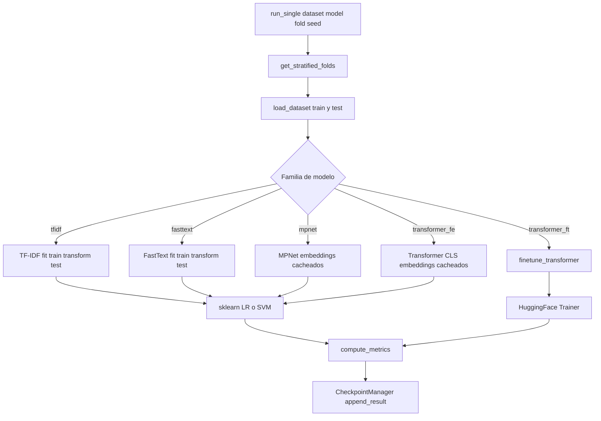

# Documentación técnica

Pipeline experimental reproducible para evaluar la **robustez al ruido textual** en la **detección binaria de depresión** a partir de textos en español. El repositorio compara 24 modelos de clasificación bajo 18 condiciones de perturbación textual, con protocolo anti-leakage, checkpoints reanudables y análisis estadístico automatizado.

---

## Tabla de contenidos

1. [Visión general y objetivos](#1-visión-general-y-objetivos)
2. [Datos](#2-datos)
3. [Diseño experimental](#3-diseño-experimental)
4. [Catálogo de modelos](#4-catálogo-de-modelos)
5. [Arquitectura del código](#5-arquitectura-del-código)
6. [Configuración YAML](#6-configuración-yaml)
7. [Pipeline de análisis](#7-pipeline-de-análisis)
8. [Dependencias y recursos externos](#8-dependencias-y-recursos-externos)
9. [Reproducibilidad y limitaciones](#9-reproducibilidad-y-limitaciones)

---

## 1. Visión general y objetivos

### Problema de investigación

Los sistemas de detección de depresión basados en texto suelen entrenarse con corpus limpios, pero en entornos reales (redes sociales, mensajes informales) el texto contiene ruido: errores ortográficos, abreviaciones, emojis, variaciones de mayúsculas, jerga, etc. Este repositorio mide **cómo se degrada el rendimiento** de distintas representaciones lingüísticas y arquitecturas Transformer cuando el mismo corpus se somete a 18 transformaciones de ruido.

### Qué hace el pipeline

1. **Entrenamiento y evaluación** de 24 modelos sobre 18 variantes del mismo corpus.
2. **Registro** de métricas por combinación `(dataset, modelo, fold, semilla)`.
3. **Agregación** de resultados, pruebas estadísticas (Friedman + Nemenyi) y generación de figuras listas para publicación.
4. **Discusión automática** a partir de los resultados agregados.

### Métrica principal

**Macro F1** — equilibra el rendimiento entre clases positiva (depresión) y negativa (sin depresión), relevante ante posible desbalance de clases.

### Escala del experimento

| Perfil | Config | Splits | Semillas | Runs totales |
|--------|--------|--------|----------|--------------|
| Publicación | `config/experiment.yaml` | 5-fold CV | 3 (42, 123, 456) | 18 × 24 × 5 × 3 = **6.480** |
| Día | `config/experiment_day.yaml` | Holdout 80/20 | 1 (42) | 18 × 24 × 1 × 1 = **432** |
| Smoke test | `config/smoke_test.yaml` | 1 fold | 1 | 4 modelos × 1 dataset = **4** |

---

## 2. Datos

### Ubicación

Todos los datasets están en `datasets_textos_depresivos/` como archivos CSV con el mismo esquema de filas (mismos `id`, misma etiqueta, texto transformado).

### Esquema CSV

| Columna | Requerida | Descripción |
|---------|-----------|-------------|
| `id` | Sí | Identificador único del documento |
| `text` | Sí | Texto de entrada para clasificación |
| `manual_classification` | Sí | Etiqueta binaria: `0` (sin depresión) o `1` (con depresión) |
| `beck_range`, `age`, `occupation`, etc. | No | Metadatos demográficos y clínicos (no usados en el pipeline) |

La validación en `src/data/loader.py` exige las tres columnas obligatorias y comprueba que las etiquetas sean exclusivamente 0 o 1.

### Condiciones de ruido textual (18 datasets)

Todos los datasets comparten los mismos documentos e identificadores; solo cambia el campo `text`:

| Dataset | Transformación aplicada |
|---------|-------------------------|
| `original` | Texto sin modificar (referencia) |
| `sin_emojis` | Emojis eliminados |
| `sin_numeros` | Dígitos y números eliminados |
| `solo_minusculas` | Todo el texto en minúsculas |
| `solo_mayusculas` | Todo el texto en mayúsculas |
| `abreviaciones` | Sustitución por abreviaciones de internet (ej. "xq", "tb") |
| `sin_acentos` | Acentos y diéresis eliminados |
| `sin_puntuacion` | Signos de puntuación eliminados |
| `sin_acentos_sin_puntuacion` | Sin acentos ni puntuación |
| `insertar_letras` | Inserción aleatoria de letras (ruido tipográfico) |
| `swap_letras` | Intercambio de letras adyacentes |
| `error_teclado` | Errores de teclado simulados (teclas vecinas) |
| `eliminar_letras` | Eliminación aleatoria de letras |
| `slang` | Sustitución por jerga / expresiones coloquiales |
| `stemming` | Reducción morfológica (stemming) |
| `ruido_combinado` | Combinación de varias perturbaciones |
| `lematizado` | Lematización morfológica |
| `sin_stopwords` | Stopwords eliminadas |

### Dataset adicional (no incluido en la config)

Existe `sin_acentos_y_minusculas.csv` en disco, pero **no** está listado en `config/experiment.yaml`. No se evalúa por defecto; puede añadirse manualmente con `--datasets sin_acentos_y_minusculas`.

### Splits compartidos

Las particiones train/test se calculan **una sola vez** a partir de las etiquetas del dataset `original` (`src/data/splits.py` → `load_reference_labels`). Esto garantiza que, para un mismo fold, el conjunto de documentos en train y test es idéntico en los 18 datasets; las diferencias de rendimiento reflejan únicamente el efecto del ruido textual.

---

## 3. Diseño experimental

### Validación cruzada

Dos modos configurables en `cv.split`:

| Modo | Parámetros | Resultado |
|------|------------|-----------|
| `kfold` | `n_folds: 5`, `fold_seed: 42` | 5 particiones estratificadas (`StratifiedKFold`) |
| `holdout` | `test_size: 0.2`, `split_seed: 42` | 1 partición 80/20 estratificada (`train_test_split`) |

### Semillas

- **`fold_seed` / `split_seed`**: fijan las particiones train/test (reproducibles entre datasets).
- **`train_seeds`**: semillas de entrenamiento por modelo (`[42, 123, 456]` en publicación; `[42]` en perfil día).
- Cada run usa `set_seed(seed)` antes del entrenamiento (`src/utils/seed.py`).

### Anti-leakage

| Componente | Ajuste en train | Aplicación en test |
|------------|-----------------|-------------------|
| TF-IDF | `fit` en train | `transform` en test |
| FastText (ponderación TF-IDF) | Vectorizador TF-IDF en train | Transform en test |
| MPNet / Transformer FE | Embeddings de train | Embeddings de test (modelo congelado) |
| Fine-tuning | Entrenamiento en train | Evaluación en test |

Los embeddings de MPNet y Transformer FE se cachean por `(dataset, fold, modelo)` en `results/cache/embeddings/` para evitar recomputación.

### Tratamiento del texto

| Familia | Longitud de texto |
|---------|-------------------|
| TF-IDF, FastText | Documento completo |
| MPNet, Transformer FE, Fine-tuning | Truncado a **512 tokens** (`text.max_length` en config) |

### Class weights

- **sklearn**: `class_weight=balanced` en LogisticRegression y LinearSVC.
- **Fine-tuning**: `CrossEntropyLoss` con pesos inversamente proporcionales a la frecuencia de clase (`WeightedTrainer` en `src/models/finetune.py`).

### Fine-tuning (familia `transformer_ft`)

| Hiperparámetro | Valor por defecto | Descripción |
|----------------|-------------------|-------------|
| `learning_rate` | 2e-5 | Tasa de aprendizaje |
| `batch_size` | 8 (16 en perfil día) | Tamaño de lote |
| `num_epochs` | 10 | Épocas máximas |
| `early_stopping_patience` | 2 | Parada temprana si no mejora val |
| `val_split` | 0.1 | 10% del train reservado para validación interna |
| `train_fraction` | 1.0 (0.5 en perfil día) | Submuestreo estratificado del train |
| `metric_for_best` | macro_f1 | Métrica para early stopping |

El perfil día usa `train_fraction: 0.5` para acelerar fine-tuning: entrena con el 50% estratificado del train, pero evalúa siempre en el test completo.

### Métricas calculadas

Por cada run se registran 9 métricas (`src/evaluation/metrics.py`):

`accuracy`, `precision`, `recall`, `f1`, `macro_f1`, `weighted_f1`, `roc_auc`, `mcc`, `balanced_accuracy`

---

## 4. Catálogo de modelos

### Convención de nombres

El parser `parse_model_id()` en `src/evaluation/runner.py` interpreta cada ID:

| Patrón | Familia | Ejemplo |
|--------|---------|---------|
| `tfidf_{lr\|svm}` | TF-IDF + clasificador | `tfidf_lr` |
| `fasttext_{lr\|svm}` | FastText + clasificador | `fasttext_svm` |
| `mpnet_{lr\|svm}` | MPNet + clasificador | `mpnet_lr` |
| `{arch}_fe_{lr\|svm}` | Transformer [CLS] + clasificador | `bert_fe_lr` |
| `{arch}_ft` | Fine-tuning end-to-end | `roberta_ft` |

Arquitecturas Transformer: `bert`, `roberta`, `deberta`, `distilbert`, `mbert`, `xlmr`.

### Tabla completa (24 modelos)

#### TF-IDF (2)

| ID | Representación | Clasificador |
|----|----------------|--------------|
| `tfidf_lr` | TF-IDF (1–2 gramos, max 50k features) | Logistic Regression |
| `tfidf_svm` | TF-IDF | Linear SVM (calibrado) |

#### FastText (2)

| ID | Representación | Clasificador |
|----|----------------|--------------|
| `fasttext_lr` | Promedio ponderado TF-IDF de vectores `cc.es.300` | Logistic Regression |
| `fasttext_svm` | Idem | Linear SVM (calibrado) |

#### MPNet (2)

| ID | Representación | Clasificador |
|----|----------------|--------------|
| `mpnet_lr` | `sentence-transformers/all-mpnet-base-v2` | Logistic Regression |
| `mpnet_svm` | Idem | Linear SVM (calibrado) |

#### Transformer Feature Extraction (12)

Embeddings del token `[CLS]` del último hidden state; modelo congelado.

| ID | Modelo HuggingFace | Clasificador |
|----|-------------------|--------------|
| `bert_fe_lr` | `bert-base-uncased` | LR |
| `bert_fe_svm` | `bert-base-uncased` | SVM |
| `roberta_fe_lr` | `roberta-base` | LR |
| `roberta_fe_svm` | `roberta-base` | SVM |
| `deberta_fe_lr` | `microsoft/deberta-v3-base` | LR |
| `deberta_fe_svm` | `microsoft/deberta-v3-base` | SVM |
| `distilbert_fe_lr` | `distilbert-base-uncased` | LR |
| `distilbert_fe_svm` | `distilbert-base-uncased` | SVM |
| `mbert_fe_lr` | `bert-base-multilingual-cased` | LR |
| `mbert_fe_svm` | `bert-base-multilingual-cased` | SVM |
| `xlmr_fe_lr` | `xlm-roberta-base` | LR |
| `xlmr_fe_svm` | `xlm-roberta-base` | SVM |

#### Transformer Fine-tuning (6)

| ID | Modelo HuggingFace |
|----|-------------------|
| `bert_ft` | `bert-base-uncased` |
| `roberta_ft` | `roberta-base` |
| `deberta_ft` | `microsoft/deberta-v3-base` |
| `distilbert_ft` | `distilbert-base-uncased` |
| `mbert_ft` | `bert-base-multilingual-cased` |
| `xlmr_ft` | `xlm-roberta-base` |

DeBERTa usa `DebertaV2Tokenizer` en lugar de `AutoTokenizer` por compatibilidad.

---

## 5. Arquitectura del código

### Estructura de directorios

```
test_noise_classifier/
├── config/                     # Configuración YAML
├── datasets_textos_depresivos/ # 18+ CSVs de ruido textual
├── docs/                       # Documentación técnica
├── scripts/
│   ├── run_experiments.py      # CLI principal de experimentos
│   ├── run_analysis.py         # CLI de análisis post-experimento
│   └── smoke_test.py           # Validación rápida del pipeline
├── src/
│   ├── data/                   # Carga de datos y splits
│   ├── features/               # TF-IDF, FastText, embeddings
│   ├── models/                 # Clasificadores sklearn y fine-tuning
│   ├── evaluation/             # Orquestación y métricas
│   ├── analysis/               # Agregación, tablas, figuras, estadística
│   └── utils/                  # Config, checkpoints, device, seeds
└── results/                    # Salidas generadas (gitignored)
```

### Mapa de módulos

| Módulo | Funciones / clases clave | Responsabilidad |
|--------|--------------------------|-----------------|
| `data/loader.py` | `load_dataset`, `load_reference_labels` | Carga y validación de CSVs |
| `data/splits.py` | `FoldSplit`, `get_stratified_folds` | Particiones compartidas k-fold / holdout |
| `features/tfidf.py` | `build_tfidf_vectorizer`, `fit_transform_tfidf` | Vectorización TF-IDF |
| `features/fasttext.py` | `FastTextEmbedder` | Embeddings FastText español con ponderación TF-IDF |
| `features/embeddings.py` | `EmbeddingExtractor` | MPNet y [CLS] de Transformers con caché |
| `models/sklearn_clf.py` | `build_classifier`, `train_predict_sklearn` | LR y SVM calibrado |
| `models/finetune.py` | `WeightedTrainer`, `finetune_transformer` | Fine-tuning HuggingFace |
| `evaluation/runner.py` | `ExperimentRunner`, `run_experiments` | Bucle principal de experimentos |
| `evaluation/metrics.py` | `compute_metrics` | 9 métricas binarias |
| `analysis/aggregate.py` | `load_fold_results`, `save_summary` | Agregación fold → resumen |
| `analysis/tables.py` | `save_tables` | Tablas para publicación |
| `analysis/statistics.py` | `run_statistical_analysis` | Friedman, Nemenyi, CD |
| `analysis/plots.py` | `generate_all_figures` | 6 figuras PNG |
| `analysis/discussion.py` | `generate_discussion` | Markdown automático |
| `utils/config.py` | `load_config`, `load_config_with_overrides` | Carga y merge de YAML |
| `utils/checkpoint.py` | `CheckpointManager` | Resume y persistencia CSV |
| `utils/device.py` | `get_device` | Selección cuda / mps / cpu |
| `utils/seed.py` | `set_seed` | Reproducibilidad |

### Flujo de un experimento individual



### Bucle principal (`run_experiments`)

`scripts/run_experiments.py` invoca `run_experiments()` que itera:

```
for dataset in datasets:
  for model_id in models:
    for fold in folds:
      for seed in seeds:
        if not completed:
          runner.run_single(...)
          checkpoint.append_result(...)
          checkpoint.mark_completed(...)
```

Por defecto **reanuda** runs ya completados consultando `results/checkpoints.json`. Usar `--no-resume` para forzar reejecución.

### Sistema de checkpoints

| Archivo | Contenido |
|---------|-----------|
| `results/checkpoints.json` | Lista de tuplas `(dataset, model, fold, seed)` completadas |
| `results/folds/results_by_fold.csv` | Una fila por run con todas las métricas |
| `results/cache/embeddings/` | Embeddings MPNet/FE cacheados (`.npy`) |
| `results/cache/fasttext/` | Modelo FastText `cc.es.300.bin` |

---

## 6. Configuración YAML

### Archivos de configuración

| Archivo | Propósito |
|---------|-----------|
| `config/experiment.yaml` | Configuración base: 18 datasets, 24 modelos, 5-fold × 3 semillas |
| `config/experiment_day.yaml` | Override: holdout 80/20, 1 semilla, `train_fraction: 0.5`, `batch_size: 16` |
| `config/smoke_test.yaml` | Override: 2 épocas FT, patience 1 (validación rápida) |

### Mecanismo de override

`load_config_with_overrides()` en `src/utils/config.py` hace un **deep-merge** del override sobre la config base. Ejemplo:

```bash
python scripts/run_experiments.py --override config/experiment_day.yaml
```

Equivale a cargar `experiment.yaml` y sobrescribir solo las claves presentes en `experiment_day.yaml`.

### Secciones de `experiment.yaml`

| Sección | Contenido |
|---------|-----------|
| `project` | Nombre del proyecto y directorio de resultados (`results/`) |
| `data` | Ruta a datasets, nombres de columnas, lista de 18 datasets |
| `cv` | Tipo de split, folds, semillas, tamaño de test |
| `text` | `max_length: 512`, `truncation: true` |
| `sklearn` | Hiperparámetros de LR y LinearSVC |
| `tfidf` | `max_features`, `ngram_range`, `min_df`, `sublinear_tf` |
| `fasttext` | URL de descarga, nombre de archivo, directorio de caché |
| `finetune` | LR, batch size, épocas, early stopping, `train_fraction` |
| `transformers` | Mapeo arquitectura → modelo HuggingFace |
| `sentence_transformer` | Modelo MPNet |
| `models` | Lista ordenada de los 24 IDs de modelo |
| `metrics` | Métrica primaria (`macro_f1`) y lista completa |
| `statistics` | `alpha: 0.05` para pruebas post-hoc |
| `plots` | DPI y tamaños de figura |

---

## 7. Pipeline de análisis

Ejecutar tras completar experimentos:

```bash
python scripts/run_analysis.py
```

Opcionalmente con `--config` para apuntar a un YAML distinto.

### Pasos internos

1. **Carga** de `results/folds/results_by_fold.csv`
2. **Agregación** → `results/results_summary.csv` y `results_summary.json`
3. **Tablas** → `results/tables/table1_full_results.csv`, `table2_global_ranking.csv`
4. **Estadística** → `results/statistics/friedman_nemenyi.json`
   - Test de Friedman sobre ranking de modelos
   - Post-hoc de Nemenyi
   - Critical Difference (CD) para diagrama
5. **Figuras** → `results/figures/` (6 PNG a 300 DPI)
6. **Discusión** → `results/discussion/discussion.md`

### Figuras generadas

| Archivo | Descripción |
|---------|-------------|
| `fig1_macro_f1_heatmap.png` | Heatmap modelo × dataset (Macro F1) |
| `fig2_mcc_heatmap.png` | Heatmap modelo × dataset (MCC) |
| `fig3_roc_auc_heatmap.png` | Heatmap modelo × dataset (ROC AUC) |
| `fig4_global_ranking.png` | Barras horizontales: ranking global por Macro F1, MCC, ROC AUC |
| `fig5_metric_boxplots.png` | Boxplots de distribución de métricas por modelo |
| `fig6_critical_difference.png` | Diagrama de diferencia crítica (Nemenyi) |

---

## 8. Dependencias y recursos externos

### Python (`requirements.txt`)

| Paquete | Uso |
|---------|-----|
| `numpy`, `pandas` | Datos y resultados |
| `scikit-learn` | Splits, TF-IDF, clasificadores, métricas |
| `scipy` | Test de Friedman |
| `matplotlib`, `seaborn` | Visualizaciones |
| `torch` | GPU, fine-tuning, extracción de features |
| `transformers`, `datasets`, `accelerate` | Modelos HuggingFace |
| `sentence-transformers` | Embeddings MPNet |
| `fasttext-wheel` | Vectores de palabras españoles |
| `scikit-posthocs` | Post-hoc de Nemenyi |
| `pyyaml` | Configuración |
| `tqdm`, `joblib` | Progreso y utilidades sklearn |

**Requisito:** Python 3.10+. Instalar PyTorch con soporte CUDA **antes** que el resto de dependencias si se usa GPU NVIDIA.

### Descargas en tiempo de ejecución

| Recurso | Tamaño aprox. | Destino |
|---------|---------------|---------|
| FastText `cc.es.300.bin` | ~4 GB | `results/cache/fasttext/` |
| Modelos HuggingFace (6 arquitecturas) | Variable | Caché de HuggingFace (`~/.cache/huggingface/`) |
| Sentence-Transformers MPNet | ~420 MB | Caché de HuggingFace |

### Hardware recomendado

| Recurso | Mínimo | Recomendado |
|---------|--------|-------------|
| GPU | 8 GB VRAM | NVIDIA 16 GB (ej. RTX 5080) |
| RAM | 16 GB | 32 GB |
| Disco | ~25 GB libres | SSD |
| CPU | 4 cores | 8+ cores (Intel i9 o equivalente) |

El perfil día completo tarda ~5–10 h en GPU NVIDIA 16 GB; en Mac Apple Silicon (MPS) ~20–35 h.

---

## 9. Reproducibilidad y limitaciones

### Garantías de reproducibilidad

- Hiperparámetros fijos en YAML; **sin búsqueda de hiperparámetros**.
- Particiones estratificadas deterministas (`fold_seed` / `split_seed`).
- Misma partición holdout para los 18 datasets.
- Semillas de entrenamiento explícitas por run.
- Checkpoints permiten reanudar sin duplicar runs.

### Limitaciones conocidas

| Limitación | Detalle |
|------------|---------|
| Sin tests automatizados | No hay `tests/` ni pytest; solo `scripts/smoke_test.py` como validación manual |
| Modelos monolingües en inglés | BERT, RoBERTa, DeBERTa y DistilBERT son `*-uncased` en inglés; se incluyen mBERT y XLM-R como referencia multilingüe |
| Truncamiento | Textos largos se truncan a 512 tokens en modelos Transformer/MPNet |
| Caché de embeddings | Si cambian splits o textos, borrar `results/cache/embeddings/` |
| Cambio de config | Si se modifica `train_fraction` u otros parámetros, usar `--no-resume` o borrar `checkpoints.json` |

### Cómo citar

Indicar el repositorio y el perfil YAML utilizado (`config/experiment.yaml` para publicación rigurosa, o `config/experiment_day.yaml` para el perfil de un día).
